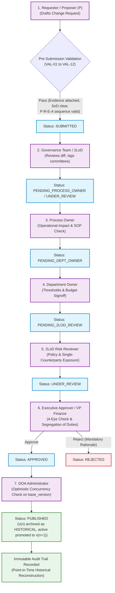
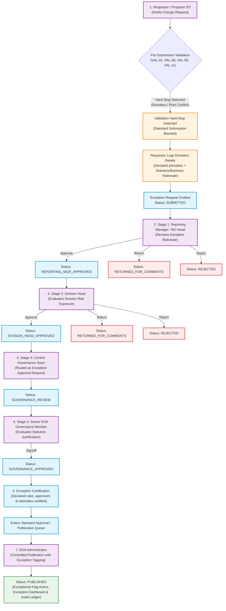

# Manual Testing Case Lifecycle Flowcharts

## 1. Standard Case Lifecycle Flowchart

```mermaid
flowchart TD
    A["1. Requestor / Proposer (P)<br/>(Drafts Change Request)"] --> B{"Pre-Submission Validation<br/>(VAL-01 to VAL-12)"}
    
    B -->|"Pass (Evidence attached, SoD clear,<br/>P-R-E-A sequence valid)"| C["Status: SUBMITTED"]
    
    C --> D["2. Governance Team / 2LoD<br/>(Reviews diff, tags committees)"]
    D --> E["Status: PENDING_PROCESS_OWNER / UNDER_REVIEW"]
    
    E --> F["3. Process Owner<br/>(Operational Impact & SOP Check)"]
    F --> G["Status: PENDING_DEPT_OWNER"]
    
    G --> H["4. Department Owner<br/>(Thresholds & Budget Signoff)"]
    H --> I["Status: PENDING_2LOD_REVIEW"]
    
    I --> J["5. 2LoD Risk Reviewer<br/>(Policy & Single-Counterparty Exposure)"]
    J --> K["Status: UNDER_REVIEW"]
    
    K --> L["6. Executive Approver / VP Finance<br/>(4-Eye Check & Segregation of Duties)"]
    
    L -->|"Approve"| M["Status: APPROVED"]
    L -->|"Reject (Mandatory Rationale)"| N["Status: REJECTED"]
    
    M --> O["7. DOA Administrator<br/>(Optimistic Concurrency Check on base_version)"]
    O --> P["Status: PUBLISHED<br/>(v(n) archived as HISTORICAL, active promoted to v(n+1))"]
    P --> Q["Immutable Audit Trail Recorded<br/>(Point-in-Time Historical Reconstruction)"]

    classDef pass fill:#e1f5fe,stroke:#0288d1,stroke-width:2px;
    classDef action fill:#f3e5f5,stroke:#7b1fa2,stroke-width:2px;
    classDef success fill:#e8f5e9,stroke:#388e3c,stroke-width:2px;
    classDef danger fill:#ffebee,stroke:#d32f2f,stroke-width:2px;
    class C,E,G,I,K,M,P pass;
    class A,D,F,H,J,L,O action;
    class Q,P success;
    class N danger;
```

---

## 2. Exceptional Case Lifecycle Flowchart

```mermaid
flowchart TD
    A["1. Requestor / Proposer (P)<br/>(Drafts Change Request)"] --> B{"Pre-Submission Validation<br/>(VAL-01, VAL-06, VAL-08, VAL-11)"}
    
    B -->|"Hard-Stop Detected<br/>(Deviation / Rule Conflict)"| C["Validation Hard-Stop Detected<br/>(Standard Submission Blocked)"]
    
    C --> D["Requestor Logs Deviation Details<br/>(Deviated principles + Statutory/Business Rationale)"]
    D --> E["Exception Request Drafted<br/>Status: SUBMITTED"]
    
    E --> F["2. Stage 1: Reporting Manager / BU Head<br/>(Reviews Deviation Rationale)"]
    F -->|"Approve"| G["Status: REPORTING_MGR_APPROVED"]
    F -->|"Return"| F1["Status: RETURNED_FOR_COMMENTS"]
    F -->|"Reject"| F2["Status: REJECTED"]
    
    G --> H["3. Stage 2: Division Head<br/>(Evaluates Division Risk Exposure)"]
    H -->|"Approve"| I["Status: DIVISION_HEAD_APPROVED"]
    H -->|"Return"| H1["Status: RETURNED_FOR_COMMENTS"]
    H -->|"Reject"| H2["Status: REJECTED"]
    
    I --> J["4. Stage 3: Central Governance Team<br/>(Routed as Exception Approval Request)"]
    J --> K["Status: GOVERNANCE_REVIEW"]
    
    K --> L["5. Stage 4: Senior DOA Governance Member<br/>(Evaluates Statutory Justification)"]
    L -->|"Signoff"| M["Status: GOVERNANCE_APPROVED"]
    
    M --> N["6. Exception Certification<br/>(Deviated rules, approvers & rationales certified)"]
    N --> O["Enters Standard Approval / Publication Queue"]
    
    O --> P["7. DOA Administrator<br/>(Controlled Publication with Exception Tagging)"]
    P --> Q["Status: PUBLISHED<br/>(Exceptional Flag Active, Exception Dashboard & Audit Ledger)"]

    classDef stop fill:#fff3e0,stroke:#f57c00,stroke-width:2px;
    classDef state fill:#e1f5fe,stroke:#0288d1,stroke-width:2px;
    classDef actor fill:#f3e5f5,stroke:#7b1fa2,stroke-width:2px;
    classDef pub fill:#e8f5e9,stroke:#388e3c,stroke-width:2px;
    classDef reject fill:#ffebee,stroke:#d32f2f,stroke-width:2px;
    class C,D stop;
    class E,G,I,K,M,N,O state;
    class A,F,H,J,L,P actor;
    class Q pub;
    class F1,F2,H1,H2 reject;
```
